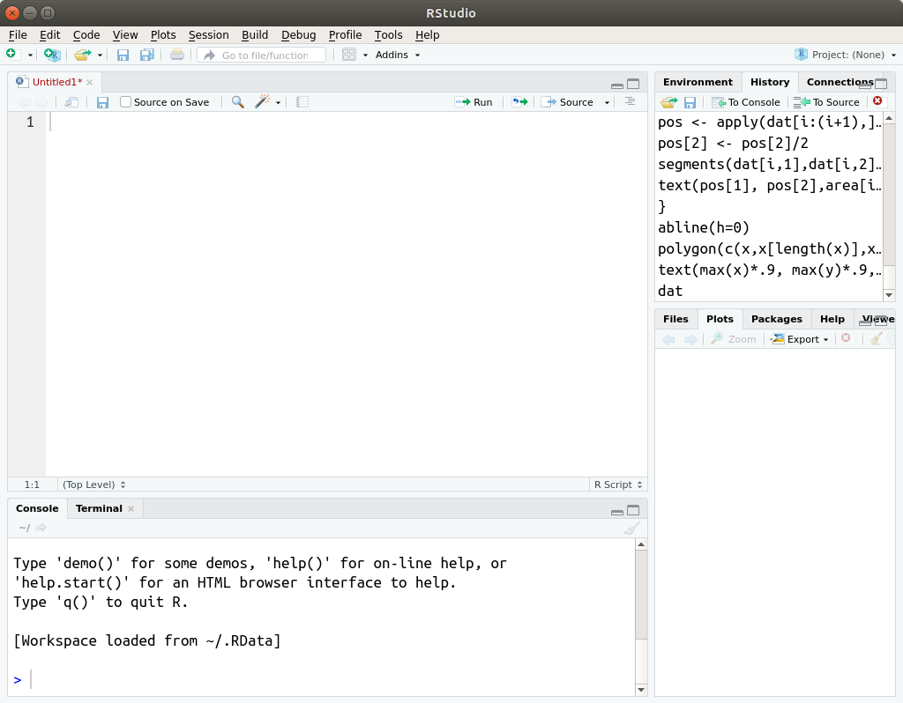
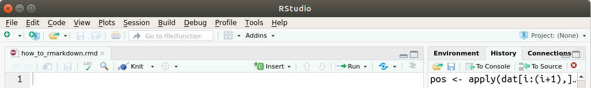
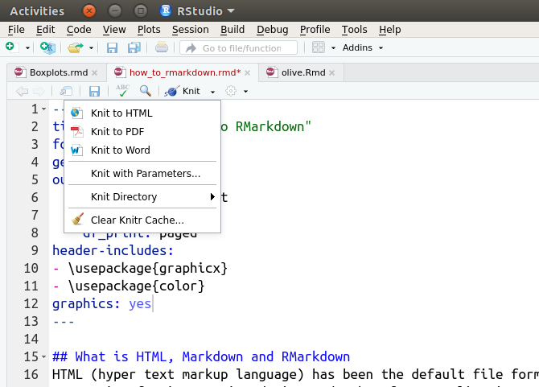

## What is HTML, Markdown and RMarkdown 
HTML (hyper text markup language) has been the default file format for web-sites; and it's been supported by CSS for layout and JavaScript for interactive design and other fancy applications. As technologies developed these became too complicated to convey information through internet.

Markdown (.md) is a simplified HTML language that does many with less effort. It is very straight-forward to use and is now widely used online for wiki pages, especially in data science / machine learning world. It is embedded in Jupyter notebooks, and websites such as StackOverflow.com, askubuntu.com, Github.com etc and many mail clients.

RMarkdown is an adaptation of markdown to R developed by people who coded RStudio. By using RMarkdown you can create _pdf files_ and __interactive HTML files__ having R code blocks, outputs, 3D plots, almost all that you will need to enter statistics and data-science world. 

## In this course
In this course you will be given tasks each week (labs) and will submit pdf files and the RMarkdown files (.rmd) that generated the pdf files.The labs can be considered as mini-assignments, each week you'll solve few hands-on exercises that will be graded which will determine 32% of your final marks.

## How to use RMarkdown
To use RMarkdown only thing you'll need is RStudio (that is properly installed). When you generate or open .rmd files RStudio will add some additional tools to the top of your editor. When you start RStudio you will see something like this:

```{r, out.width = "600px", echo = F}

```

When you write something and save the file (ctrl+s) as some_file_name.rmd, you will receive a warning, "Are you sure you want to change the file type". If you press "yes" you will see additional tools on your editor:

```{r, out.width = "900px", echo = F}

```

After filling in your .rmd file, you need to "Knit" what you have done using the Knit button on the top of your editor. You have three options, Knit to HTML, Knit to PDF and Knit to Word. Press the second:

```{r, out.width = "600px", echo = F}

```

It will generate a PDF file into the same folder where .rmd file is located.

## Starting from the end
Let's generate a PDF file using RMarkdown:

1. Open RStudio
2. Open a new tab on your editor (shortcut: press Ctrl+Shift+N)
3. Save the empty file in .rmd format (e.g. my_first_rmarkdown.rmd)
4. Copy the following code block to your file:

```
---
title: "RMarkdown O'mine"
author: Me
fontsize: 10pt
geometry: margin=.75in
output:
  pdf_document: default
  html_document:
    df_print: paged
header-includes:
- \usepackage{graphicx}
- \usepackage{color}
graphics: yes
---

# Sweet RMarkdown O'Mine
My RMarkdown's got a smile that it seems to me
Reminds me of childhood memories
Where everything
Was as fresh as the bright blue sky

RMarkdown o' mine
RMarkdown of mine
```

## A fancier PDF with RMarkdown

---------------------------------------------


# RMarkdown Basics

An RMarkdown file consists of two main parts:
1. __Header__ that contains meta-properties and basics such as  author, date, title etc., file properties (margins, font-size) and additional parameters (extra packages etc.)
2. __Body__ that contains everything else

# Header
A header is in form of YAML, yet another markdown language. It usually doesn't change. You can copy-paste and tweak the following for all your submissions:

```
---
title: "Rhytmic Illusions, Week 1"
author: Gavin Harrison, 20803409
fontsize: 10pt
geometry: margin=.75in
output:
  pdf_document: default
  html_document:
    df_print: paged
header-includes:
- \usepackage{graphicx}
- \usepackage{color}
graphics: yes
---
```

# Markdown Language
Markdown language inherits many features of HTML for you to create very basic websites; including header (H1, H2, ..., H6), images, ordered lists, unordered lists, tables, links, emphasis (bold, italic)

## Emphasis
You can emphasize pieces of your work using bold, italic, bold & italic and strikethrough (not sure if you'll need):

```
Gavin Richard Harrison is an English drummer. He is _best_ known
for playing with progressive rock bands, __King Crimson__ and __Porcupine Tree__. 

He has received *many awards* and earned praise from other musicians such as
**Mike Portnoy**, **Neil Peart** and **Steve Smith**.

___Source: Wikipedia___

```
which looks like:

Gavin Richard Harrison is an English drummer. He is _best_ known for playing with progressive rock bands, __King Crimson__ and __Porcupine Tree__. 

He has received *many awards* and earned praise from other musicians such as **Mike Portnoy**, **Neil Peart** and **Steve Smith**.

___Source: Wikipedia___


## Headers
-------------------------------------
You can use # for entering a header. You can create headers in different sizes as below:

```
# Header 1
## Header 2
### Header 3
#### Header 4
##### Header 5
###### Header 6
```
which looks like


# Header 1
## Header 2
### Header 3
#### Header 4
##### Header 5
###### Header 6


## Ordered and Unordered Lists
-------------------------------------
To create ordered lists you can use 1., 2., ... as below:

```
1. Here is the first element
2. Here is the second
3. And the third
```
which looks in your PDF like

1. Here is the first element
2. Here is the second
3. And the third

You can create unordered lists using *, + or - signs as:

```
* Here is the first element
* Here is the second
* And the third
+ This is not a love song
- I don't sing my mother tongue
- No, this is not a love song
```

which looks like:

* Here is the first element
* Here is the second
* And the third
+ This is not a love song
- I don't sing my mother tongue
- No, this is not a love song

## Links
In your text you can insert hyperlinks easlily as:

```
[More information for Gavin Harrison](https://en.wikipedia.org/wiki/Gavin_Harrison)

Click [here](https://www.youtube.com/watch?v=SZqwvjwqwK4) for amazing drumming
recorded by a fridge.

```

[More information for Gavin Harrison](https://en.wikipedia.org/wiki/Gavin_Harrison)

Click [here](https://www.youtube.com/watch?v=SZqwvjwqwK4) for amazing drumming
recorded by a fridge.

## Inserting Images
There are several ways to insert images, e.g. (1) by using plain markdown language, (2) using HTML coding, (3) using RMarkdown specific 
features. 

#### via Markdown
```

```


### via HTML
By using HTML you can also play with the size of the image
```

```


### via RMarkdown
You can use RMarkdown tools which we will cover later. NOTE: remove the  | sign to use:

```
|```{r, out.width = "300px", echo = F}

|``` 
```

```{r, out.width = "300px", echo = F}

```

## Blockquotes

```
Wise man once said:

> Progress always appears much greater than it actually is.
```

Wise man once said:

> Progress always appears much greater than it actually is.

## Inline HTML Codes
You can simply use HTML code blocks if you find it more convenient:

```
<b>Gavin Richard Harrison</b><sup id="cite_ref-1" class="reference"><a href="#cite_note-1">[1]</a></sup> (born 28 May 1963)<sup id="cite_ref-allmusic_2-0" class="reference"><a href="#cite_note-allmusic-2">[2]</a></sup> is an English musician. He is best known for playing with the <a href="https://en.wikipedia.org/wiki/Progressive_rock" title="Progressive rock">progressive rock</a> bands <a href="/wiki/Porcupine_Tree" title="Porcupine Tree">Porcupine Tree</a> and <a href="https://en.wikipedia.org/wiki/King_Crimson" title="King Crimson">King Crimson</a>. Harrison's drumming has received many awards from music publications and earned praise from other musicians.
```

<b>Gavin Richard Harrison</b><sup id="cite_ref-1" class="reference"><a href="#cite_note-1">[1]</a></sup> (born 28 May 1963)<sup id="cite_ref-allmusic_2-0" class="reference"><a href="#cite_note-allmusic-2">[2]</a></sup> is an English musician. He is best known for playing with the <a href="/wiki/Progressive_rock" title="Progressive rock">progressive rock</a> bands <a href="/wiki/Porcupine_Tree" title="Porcupine Tree">Porcupine Tree</a> and <a href="/wiki/King_Crimson" title="King Crimson">King Crimson</a>. Harrison's drumming has received many awards from music publications and earned praise from other musicians.

[___Source Wikipedia___](https://en.wikipedia.org/wiki/Gavin_Harrison)

# References & Resources
1. https://github.com/adam-p/markdown-here/wiki/Markdown-Cheatsheet
1. https://ourcodingclub.github.io/tutorials/rmarkdown/#identify